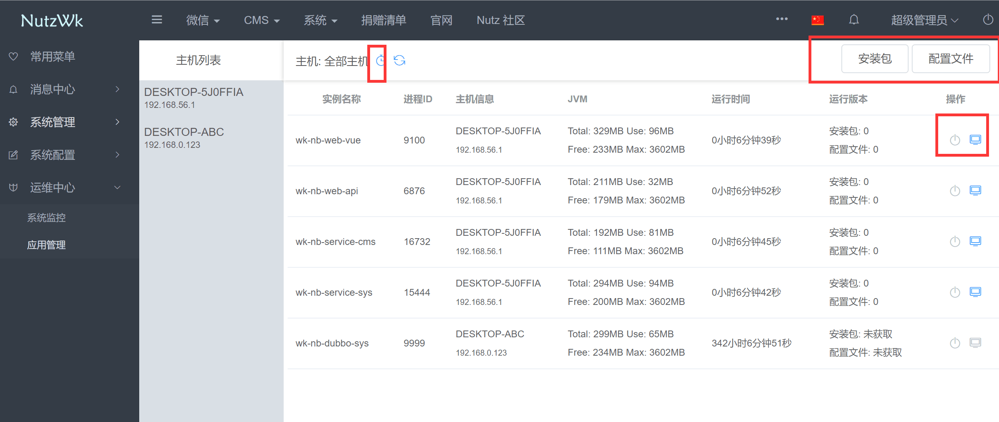

# PythonWk
NutzWk 微服务开发框架应用守护进程 https://wizzer.cn

* 基于 Python 3.x 开发
* 支持 NutzWk 5.1.6 以上版本
* 支持分布式部署
* 可用性：试用，欢迎提交issue

## QQ交流群
* 1群: 68428921 (已满)
* 2群: 24457628


## 使用说明

* 根据配置要求将jar包及配置文件置于指定文件夹
* 服务器的主机名不可重复
* 执行 `python server.py` 启动守护进程

## 配置说明

* settings.py 配置文件内容
```python
#!/usr/bin/python
# -*- coding: utf-8 -*-
# 初始jar包及配置文件文件夹,jar文件及配置文件以实例名为文件名,文件名中不包含版本号
APP_JARS = 'C://data/jars/'
# 运行目录,不要手动创建,启动时判断目录是否存在来初始化项目
APP_ROOT = 'C://data/nutzwk/'
# jar文件名,名称要保持与配置文件里 nutz.application.name 值一致
# 如果是单机 wk-nb-service-sys 一定为第一个启动项目
APP_LIST = [
    'wk-nb-service-sys',
    'wk-nb-service-cms'
]
# jar包启动的jvm配置参数
APP_OPTS = {
    'wk-nb-service-cms': ''
}
# 通信密钥,保持与 wk-nb-web-api 模块里配置内容一致,用于心跳通信
HTTP_SECRET_ID = 'wizzer'
HTTP_SECRET_KEY = 'nutzwk'
# API路径
HTTP_URL = 'http://127.0.0.1:9001/open/api/deploy'
# 心跳周期(单位:秒)
HTTP_HEARTBEAT = 10
HTTP_TIMEOUT = 5

CACHE_TASK_IDS = []
CACHE_HOST_NAME = ''
```
* 初始化时 APP_JARS 文件列表示例
```text
    wk-nb-service-cms.jar
    wk-nb-service-cms.properties
```

## NutzWk 配置文件

```text
    #实例名称与打包成功后的jar文件名保持一致
    nutz.application.name=wk-nb-service-cms
    
    #动态修改日志等级,启用
    logback.exts.loglevel.enabled=true
    #心跳间隔(单位:秒)
    logback.exts.loglevel.heartbeat=10
    
    #为应用管理提供支持,启用获取部署版本号,结合守护进程使用
    logback.exts.deploy.enabled=true
    #为应用管理提供支持,部署根路径
    logback.exts.deploy.root=C://data/nutzwk
```

## 管理后台界面

